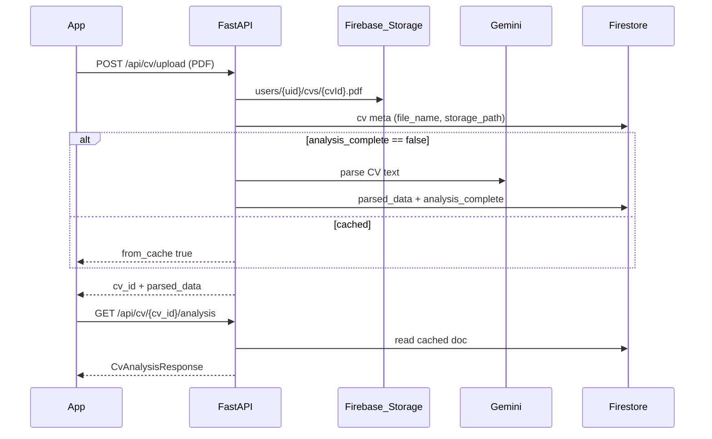

# Backend: CV yükleme, Gemini analiz, Firestore önbellek

Mobil uygulama (`CoachAl-Mobile`) aşağıdaki REST sözleşmesini bekler. LinkedIn/Gemini/Firestore işlemleri **yalnızca backend** üzerinde yapılmalıdır.

## Akış



## Firestore şeması

Koleksiyon (web backend): `cv_documents` (`user_id` ile filtrelenir). Alternatif şema: `users/{firebase_uid}/cvs/{cv_id}` — mobil yalnızca REST kullanır.

```json
{
  "cv_id": "uuid",
  "file_name": "cv.pdf",
  "storage_path": "users/uid/cvs/uuid.pdf",
  "created_at": "2026-05-20T12:00:00Z",
  "analyzed_at": "2026-05-20T12:01:00Z",
  "analysis_complete": true,
  "parsed_data": {
    "skills": ["Python", "React"],
    "experience_years": 3,
    "education_level": "Lisans",
    "summary": "...",
    "match_score_logic": "..."
  },
  "extracted_text_preview": "..."
}
```

Mobil doğrulama: `src/schemas/cvAnalysisSchema.ts` (`CvAnalysisRecordSchema`).

## Endpoint’ler

### `GET /api/cv/list`

Firebase Bearer zorunlu.

**Yanıt:**

```json
{
  "items": [
    {
      "cv_id": "uuid",
      "file_name": "cv.pdf",
      "created_at": "ISO-8601",
      "analysis_complete": true,
      "storage_path": "users/uid/cvs/uuid.pdf"
    }
  ]
}
```

**Kural:** Kullanıcı başına en fazla **3** kayıt. `POST /cv/upload` 4. dosyada `400` + `detail`.

### `POST /api/cv/upload`

- `multipart/form-data`, alan: `file` (PDF, max 10MB)
- Storage’a yükle → `cv_id` üret
- Firestore’da `analysis_complete` kontrolü:
  - **Yoksa / false:** PDF metnini çıkar → **Gemini** → `parsed_data` yaz → `analysis_complete: true`
  - **Varsa:** Gemini **çağırma**, mevcut `parsed_data` dön

**Yanıt (mobil `CvUploadResponse`):**

```json
{
  "cv_id": "uuid",
  "file_name": "cv.pdf",
  "parsed_data": { "skills": [], "summary": "", "match_score_logic": "" },
  "extracted_text_preview": "...",
  "from_cache": false,
  "analysis_complete": true
}
```

### `GET /api/cv/{cv_id}/analysis`

Önbellek okuma. Yoksa `404`.

**Yanıt (`CvAnalysisResponse`):**

```json
{
  "cv_id": "uuid",
  "file_name": "cv.pdf",
  "analysis_complete": true,
  "parsed_data": { },
  "analyzed_at": "ISO-8601",
  "storage_path": "..."
}
```

### `DELETE /api/cv/{cv_id}`

Firestore kaydı + Storage dosyasını sil.

## Ortam değişkenleri (örnek)

- `GOOGLE_APPLICATION_CREDENTIALS` veya Firebase Admin SDK
- `FIREBASE_STORAGE_BUCKET`
- `GEMINI_API_KEY`
- `MAX_CVS_PER_USER=3`

## FastAPI iskelet (referans)

```python
@router.post("/cv/upload")
async def upload_cv(file: UploadFile, user=Depends(get_current_user)):
    if await count_user_cvs(user.uid) >= 3:
        raise HTTPException(400, "En fazla 3 CV")
    cv_id = str(uuid4())
    path = await storage_upload(user.uid, cv_id, file)
    doc = await firestore_get_cv(user.uid, cv_id)
    if doc and doc.get("analysis_complete"):
        return {**doc, "from_cache": True}
    text = extract_pdf(file)
    parsed = await gemini_analyze_cv(text)
    await firestore_save_analysis(user.uid, cv_id, path, file.filename, parsed)
    return {"cv_id": cv_id, "file_name": file.filename, "parsed_data": parsed, "analysis_complete": True}

@router.get("/cv/{cv_id}/analysis")
async def get_analysis(cv_id: str, user=Depends(get_current_user)):
    doc = await firestore_get_cv(user.uid, cv_id)
    if not doc or not doc.get("analysis_complete"):
        raise HTTPException(404, "Analiz yok")
    return doc
```

## Mobil dosyalar

| Dosya | Rol |
|-------|-----|
| `src/services/api.ts` | `listUserCvs`, `getCvAnalysis`, `uploadCvPdf`, `deleteCv` |
| `src/components/cv/CvLibraryPanel.tsx` | Ayarlar → CV yükleme (max 3) |
| `src/screens/CvParsedResultScreen.tsx` | Analiz sonuç ekranı |
| `src/screens/CvAnalysisScreen.tsx` | Kayıtlı CV seçimi + yönlendirme |
| `src/schemas/cvAnalysisSchema.ts` | Firestore JSON şeması |
